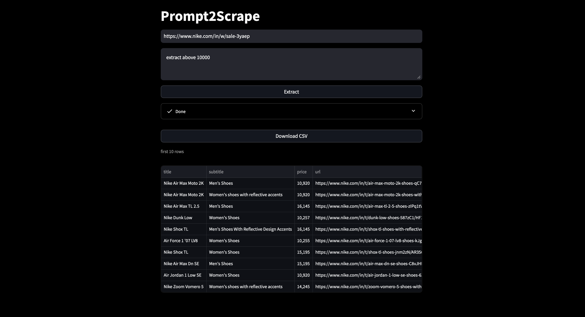

# Prompt2Scrape

A **prompt-driven web scraping tool** that extracts structured data (products/services/listings) from any webpage using **natural language prompts**, instead of writing manual CSS selectors. It generates an extraction plan using an LLM, extracts candidate rows/cards from HTML, applies universal filtering, and exports results as structured output.

---

## Features
- **Prompt-based scraping:** Give URL + prompt, tool decides what to extract.
- **LLM extraction planning:** Automatically generates extraction plan from cleaned HTML.
- **Universal filtering:** Works across websites (not only ecommerce).
- **Structured extraction:** Converts card/listing pages into structured rows.
- **Exports output:** Saves extracted results in structured formats like CSV/JSON.
- **Website-agnostic:** Works for products, services, directories, listings, etc.

---

## Required Dependencies

### Python (3.10+ recommended)
- Python 3.10 or newer
- pip
- OpenAI API key

### Libraries
Install dependencies via:
- `pip install -r requirements.txt`

---

## Setup + Steps to Run

### 1) Clone the repository
- `git clone <REPO_URL>`
- `cd prompt2scrape`

### 2) Create virtual environment
- `python3 -m venv venv`
- `source venv/bin/activate`

### 3) Install dependencies
- `pip install -r requirements.txt`

### 4) Configure API key
Create a `.env` file:
- `OPENAI_API_KEY=your_openai_key_here`

### 5) Run the tool
- `python -m streamlit run app.py`

### 6) Provide inputs
When prompted:
- Paste the **URL**
- Enter the **Prompt**

Example prompt:
- `Extract only women's products. Return name, price, discount, rating.`

### 6) Output
- Downloadable CSV
- first 10 rows of the scraped data

